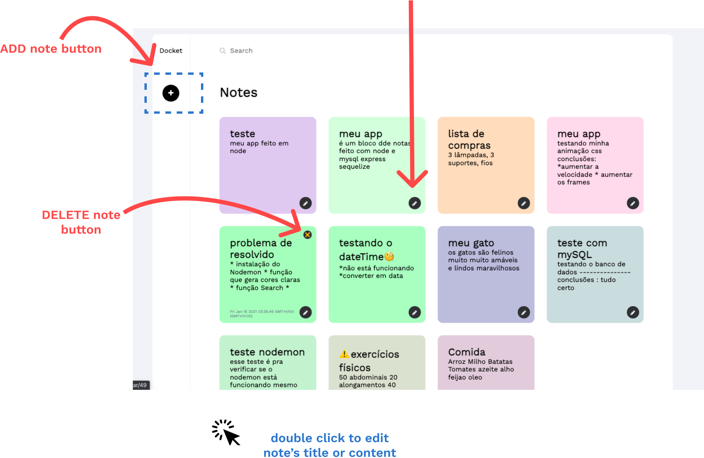

# Notepad with node

backend made in NODE with a mysql database

frontend made with pure html and css 

<p align="center">
    
</p>
<p align="center">
    
</p>
<p align="center">
    
</p>
<p align="center">
    
</p>
you can run this projet installing those dependencies : 

```npm install express --save```

```npm install --save sequelize```

```npm install mysql2```

```npm install nodemon -g```

```npm install --save express-handlebars```

```npm install --save body-parser```
