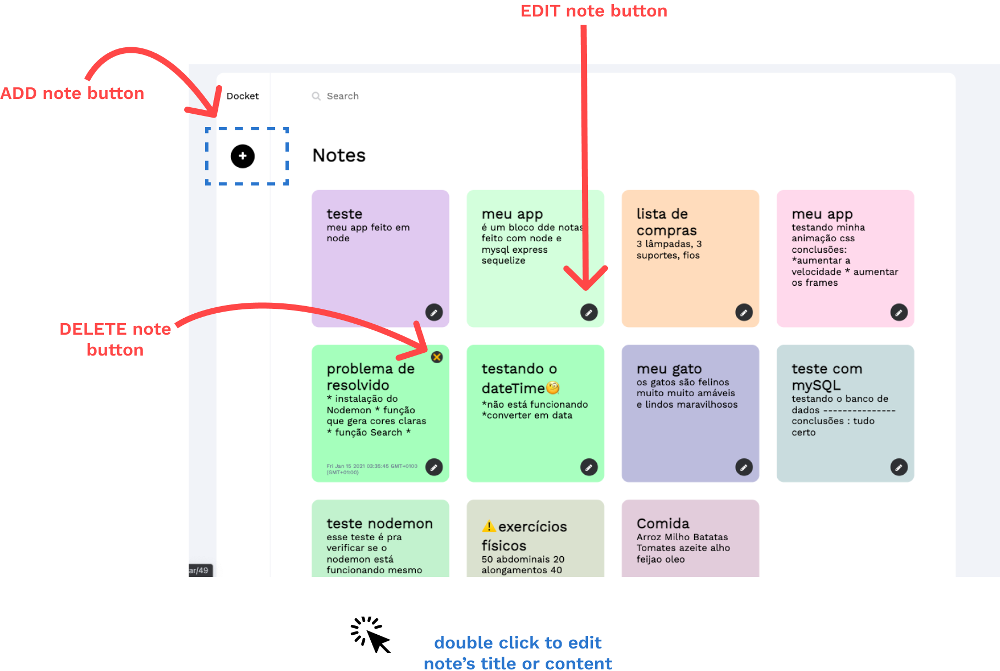

[](https://gitpod.io/#https://github.com/talisma-cassoma/Notepad-with-nodeJs)

# Notepad web app with node
This is a CRUD application with backend in Node.js and mysql database

frontend made with pure html and css 

credits for <a href="https://dribbble.com/shots/14037848-Docket-note-Side-menu">Ariuka</a> from dribble for <a href="https://dribbble.com/shots/14037848-Docket-note-Side-menu">UI design</a>

<h2>Frontend</h2>

<p align="center">
    
</p>
<p align="center">
    
</p>
<p>
the button changes depending on the mode
if we just see the notes it stays like this:</p>
<p align="center">
    
</p>
<p>but if you edit the note it changes like that</p> 
<p align="center">
    
</p>

<h2>Backend</h2>

<p>you can run this projet by runnig thoses commands:</p> 

```npm install```

```npm run dev```

<p>if wanna use a mySQL database -> create js file and run this code on node:</p>

```js
cont db =require("./module/db") //<-- db.js directory 
const Post = db.sequelize.define('postagens', {
    titulo: {
        type: db.Sequelize.STRING(50)
    },
    conteudo:{
        type: db.Sequelize.TEXT
    }
})

Post.sync({force: true});//para forçar a criar ...

db.sequelize.authenticate().then(function(){
    console.log('conectado ao banco de dados')
}).catch(function(erro){
    console.log('erro de coneccao'+ erro)
})
```
